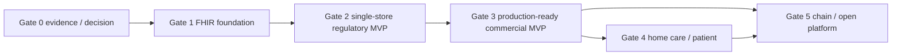

# yrese / PH-OS v0.7 priority, release-gate, and dependency plan

```yaml
proposal_id: WP-0054e-20260716
status: DRAFT
implementation_authority: none
created_at: 2026-07-16
baseline_commit: b5abafc
source_refs:
  - docs/research/rececon_v0_7_current_state_coverage_20260716.md
  - docs/research/rececon_v0_7_compliance_matrix_20260716.md
  - docs/regulatory/regulatory_blockers.md
  - docs/operations/go_no_go_checklist.md
  - docs/product/mvp_scope.md
blockers:
  - BLOCKED_GATE0
  - BLOCKED_HUMAN_APPROVAL
```

## 1. Result

This plan decomposes v0.7 into 40 bounded work packages across Release Gates 0-5. It is
a planning artifact only. It does not alter APPROVED MVP scope or authorize Gate 1 code.

Key reprioritization decisions:

- evidence, legal/clinical control, FHIR authority, identity, calculation, claim,
  accounting integrity, retention, migration reversibility, offline recovery, security,
  and end-to-end dispensing safety are P0;
- dispensing workflow moves from the draft P1 list to P0 because a production pharmacy
  cannot safely complete the patient journey without segregation, verification, rework,
  and handover controls;
- public-system document ingestion and simulator/contract work may proceed before a live
  connection, but connection code cannot bypass ONS/terms/certificate/test gates;
- AI, home care, patient engagement, multistore, and open-platform differentiation stay
  downstream of the single-store regulatory core;
- no current domain is considered release-complete: WP-0054b found 0/22 fully
  implemented domains.

## 2. Scoring model

Each work package is scored from repository evidence, not product enthusiasm:

```text
score = 5*patient_safety
      + 5*legal_or_claim
      + 4*data_authority
      + 3*migration_reversibility
      + 2*commercial_value
      + 3*dependency_centrality
```

Each dimension is 0-5. Priority bands are:

| priority | rule |
|---|---|
| P0 | score >= 70, or any hard patient-safety/legal/claim/data-authority release gate |
| P1 | score 50-69 and required for commercial production readiness |
| P2 | score 30-49 and required for home care/patient experience or scale after core readiness |
| P3 | score < 30 and differentiating/advanced platform capability |

Risk is independent of priority:

- `R4`: human authority required before implementation or production use;
- `R3`: architecture/data/security/medical safety review required;
- `R2`: normal contract-first implementation with independent verification;
- `R1`: isolated low-impact work.

## 3. External dependency update used by this DAG

Live official pages were rechecked on 2026-07-16:

- MHLW electronic-prescription vendor material lists technical guide 2.04 (July 2026)
  and vendor self-check 4.2. Public document ingestion and test planning can proceed;
  ONS record-condition/IF material, certificate/signature setup, and connection evidence
  still gate a real adapter.
- Digital Agency PMH publishes medical-expense-aid vendor specifications, test material,
  pre-use and operation-verification checklists, and June 2026 terminology/master files.
  Participation, municipality coverage, current terms, environment setup, and exact
  artifact promotion still gate production behavior.
- JAHIS 2D symbol 1.11 is publicly listed. Its exact artifact/license and synthetic
  conformance set must be registered before adapter implementation.
- Online eligibility requires the official portal/terminal/use terms and vendor path;
  an unofficial cloud-direct integration is never an alternative dependency edge.

These findings split each official adapter into `evidence/test design` and
`authorized connection` packages so missing external authority does not silently spread
into unrelated foundations.

## 4. Work-package contracts

Common rules for all rows:

- owner: `codex_root` coordinates and appoints one sole maintainer for an approved exact
  path; the owner column names the accountable technical/domain role, not an agent lane;
- verifier: an independent verifier plus listed specialists, none of whom authored the
  change;
- rollback: means design/runtime rollback evidence, not permission to execute production
  rollback;
- demo: synthetic or appropriately de-identified data only;
- every R4 human gate is additive and cannot be replaced by Codex review.

### Gate 0 - specification, evidence, boundaries, and human decision

| WP | scope | score / priority / risk | dependencies | entry | exit | rollback | synthetic demo | owner / verifier | human gate |
|---|---|---|---|---|---|---|---|---|---|
| G0-01 | recover/version/hash v0.5-v0.7 predecessor artifacts and exact normative deltas | 78 / P0 / R3 | WP-0054a/c | source location and rights known | 38/38 deltas re-evaluated; missing-source list zero or explicitly accepted | retain prior registry and mark new source rejected | source-to-requirement diff report | product/spec / independent spec+license | product authority for source precedence |
| G0-02 | exact official artifact retrieval, license classification, REG-001/007 promotion candidates | 92 / P0 / R4 | WP-0054c/d | official locator and retrieval right | exact version/hash/applicability; evidence promotion decision recorded | revoke candidate; no implementation reference remains | evidence manifest verifier | regulatory / legal+claims+security | legal, pharmacist, claims, security as applicable |
| G0-03 | legal/regulatory/clinical matrix SSOT amendment candidates | 100 / P0 / R4 | G0-02, WP-0054d | exact artifacts available per row | REG-003 candidate has effective interval, control, test, watch and sign-off | keep current APPROVED REG-003/blockers | current/future retention boundary cases | regulatory / legal+medical+data | legal, pharmacist, claims, privacy/security |
| G0-04 | priority/release DAG and dependency audit | 82 / P0 / R3 | WP-0054b/d | path-level coverage and blockers available | cycle=0; bypass=0; all WPs have entry/exit/rollback/demo/owner/verifier/gate | revert to prior draft priorities | generated DAG and gate-failure report | architecture / independent architect+test | product authority accepts release order |
| G0-05 | 5-layer/3-plane/domain/API/module authority boundaries | 94 / P0 / R4 | G0-03/04, WP-0053 | authority and compliance inputs available | clinical/business/control/adapter boundaries; tenant/store authority; duplicate authority=0 | preserve existing approved boundaries | request/event ownership walkthrough | architecture / FHIR+API+data+security | pharmacist, FHIR, privacy/security, product |
| G0-06 | critical journeys, Guided/Expert shared state, safety UX and measurable performance/KPI protocol | 79 / P0 / R4 | G0-03/05 | state/authority vocabulary fixed | three journeys, fixed context, pending/final semantics, keyboard/accessibility tests and measurement protocol | retain current UI; no new workflow claims | clickable synthetic journey/protocol | UX / medical+accessibility+test | pharmacist, claims practitioner, operations |
| G0-07 | offline/security/migration/operations integrated matrices | 96 / P0 / R4 | G0-03/05 | operation/data classes and external dependencies fixed | operation x mode result unique; RTO/RPO/restore/cutover/support/PHI responsibilities defined | disable candidate modes; preserve fail-closed states | failure/recovery tabletop | reliability / security+privacy+data+ops | production security, pharmacy operator, privacy |
| G0-08 | Gate 0 approval packet and Gate 1 WP reissue | 100 / P0 / R4 | G0-01..07 | all Gate 0 outputs independently verified | explicit approve/reject/dissent/expiry; Gate 1 exact scope reissued | no Gate 1 start; remain BLOCKED_GATE0 | decision packet traceability demo | product / all independent specialists | pharmacist, claims, legal, FHIR, security/privacy, data, operations/product |

### Gate 1 - FHIR-native foundation

| WP | scope | score / priority / risk | dependencies | entry | exit | rollback | synthetic demo | owner / verifier | human gate |
|---|---|---|---|---|---|---|---|---|---|
| G1-01 | FHIR R4/JP Core/canonical/terminology package lock and profile registry | 87 / P0 / R3 | G0-08 | reissued scope and exact packages | lock/hash/canonical namespace/profile registry; validator fixture passes | package-lock rollback with migration-not-started proof | JP Core synthetic resources validate | FHIR / FHIR+data+test | FHIR and pharmacist baseline approval |
| G1-02 | FHIR persistence, history, search projection, REST, transaction, OperationOutcome and CapabilityStatement | 92 / P0 / R3 | G1-01, G0-05 | persistence/API contract approved | read/vread/search/history/create/update/transaction, optimistic concurrency, rebuildable projection and declared capability tests | reversible schema/API flag; history preserved | create/search/version/conflict transaction | FHIR backend / FHIR+API+DB+security | data/security approval before PHI use |
| G1-03 | Patient identity, identifiers, representative, consent and merge/split foundations | 91 / P0 / R4 | G1-01/02, G0-03 | identity/consent authority approved | deterministic candidate matching only; audited merge/split; consent revocation and context banner contracts | disable merge; preserve aliases/history | duplicate/representative/revoked-consent journey | identity / privacy+medical+data | pharmacist + privacy/legal |
| G1-04 | tenant/store/auth/RBAC/ABAC/audit/secret/security control foundation | 100 / P0 / R4 | G0-07, G1-02 | security architecture and provider responsibility approved | deny-by-default, cross-tenant isolation, MFA design, AuditEvent, support boundary, secret/SBOM gates pass | production auth remains disabled; reversible feature flags | cross-tenant denial and audit evidence | security / security+privacy+DB+API | production security authority |
| G1-05 | master/terminology/version/effective-date ingestion foundation | 94 / P0 / R4 | G0-02/03, G1-01 | promoted source rights/schema | signed/hash-checked staging, referential/terminology validation, atomic activation/rollback and historical lookup | reactivate prior version; replay proof | future/backdated master activation | master/calculation / claims+FHIR+data | claims practitioner + pharmacist |
| G1-06 | Edge node, outbox/inbox, technical control plane and local device skeleton | 82 / P0 / R3 | G0-05/07, G1-02/04 | mode/security matrix approved | idempotent encrypted queue, health, retry/dead letter, no duplicated clinical authority | disable Edge writer; retain replayable queue | disconnect/reconnect/duplicate delivery | reliability / security+data+ops | pharmacy operator/security before deployment |
| G1-07 | UI shell using public Clinical Data Plane and approved business contracts | 70 / P0 / R3 | G0-06, G1-02/03/04 | shared state and API contracts approved | fixed patient/store/mode, pending/final semantics, error/loading/accessibility, no hidden clinical API | feature flag to current shell | Guided/Expert patient context journey | frontend / UX+accessibility+API+medical | pharmacist safety UX approval |

### Gate 2 - single-store regulatory MVP

| WP | scope | score / priority / risk | dependencies | entry | exit | rollback | synthetic demo | owner / verifier | human gate |
|---|---|---|---|---|---|---|---|---|---|
| G2-01 | prescription ingress trust model, paper/manual/JAHIS candidate mapping and lifecycle | 97 / P0 / R4 | G1-01..05, G0-03 | source/profile/terminology and clinical authority approved | immutable source/hash, provisional-to-pharmacist-confirmed path, complex dosage/version/diff/concurrency tests | disable each ingress adapter; preserve source | paper/manual/JAHIS synthetic prescriptions | prescription / pharmacist+FHIR+medical+data | pharmacist + JAHIS/license where used |
| G2-02 | deterministic calculation coverage, public expense boundary and trace | 100 / P0 / R4 | G0-02/03, G1-05, G2-01 | promoted fee/rule evidence and approved coverage | only supported claims calculate; official/golden/property/date replay 100%; evidence/trace complete | pin prior rule; block affected claim dates | supported/unsupported/date-boundary calculation | calculation / pharmacist+claims+test | pharmacist + claims practitioner |
| G2-03 | legal documents, dispensing record, receipt/detail, retention/rendering | 96 / P0 / R4 | G0-03, G2-01/02 | record fields/retention/template authority approved | version/hash/reissue/print-failure/restore/readability/retention tests | pin prior template; block issuance if nonreproducible | record/receipt render and reissue | documents / legal+pharmacist+privacy+data | legal + pharmacist |
| G2-04 | append-only accounting, copayment, payment allocation, refund and receipt numbering | 98 / P0 / R4 | G2-02/03, G1-06 | calculation/document authority and offline numbering policy approved | balanced append-only ledger, partial/unpaid/refund/cancel/idempotency/reconciliation tests | compensating entries only; no destructive reversal | partial payment/refund/offline number merge | accounting / claims+data+security | claims practitioner + finance/legal |
| G2-05 | claim intermediate model, precheck, immutable snapshot/lock and electronic receipt generator | 100 / P0 / R4 | G2-01..04, G1-05 | record-condition evidence and claim scope approved | official-format/golden validation 100%; unsupported/external-pending blocked; snapshot immutable | revoke generator version; preserve locked claims | claim/precheck/error-correction/handoff | claim / claims+legal+data+test | claims practitioner + legal |
| G2-06 | eligibility/e-prescription/PMH evidence adapters, simulators and authorized-connection slices | 95 / P0 / R4 | G0-02/03/05, G1-04/05/06, G2-01/05 | public artifacts promoted; connection slice additionally needs terms/ONS/cert/test authority | simulator contracts pass; live slice only after official connection/self-check; unavailable never success | disable live adapter; pending/recheck fallback | timeout/stale/refill/PMH municipality simulator | integration / security+claims+pharmacist | official authority + pharmacist + claims + security |
| G2-07 | minimum clinical safety boundary, external result provenance and non-SaMD feature inventory | 92 / P0 / R4 | G0-03, G2-01, G2-06 | intended-use/SaMD decision per feature | unknown/not-checked/no-issue separated; external result unmodified; blocked features absent; override audited | disable alert feature; retain source data | stale/external/override safety scenarios | safety / pharmacist+medical+legal | pharmacist + SaMD/legal authority |
| G2-08 | LOCAL_ONLY reception/calculation/document/accounting and RECOVERY_SYNC | 100 / P0 / R4 | G1-06, G2-01..05, G0-07 | mode matrix and authoritative versions approved | allowed/forbidden matrix enforced; provisional states; revalidation/conflict/human review/idempotency tests | disable offline creation; export queue for recovery | cloud outage through reconciled recovery | reliability / data+security+claims+medical | pharmacy operator + security + pharmacist |
| G2-09 | migration dry-run, mapping, reconciliation, old-system reference and rollback rehearsal | 98 / P0 / R4 | G0-03/07, G1-03/05, G2-01..05 | named source systems/formats and retention/rights approved | count/money/code/FHIR/unmigrated reports; repeatable dry run; rollback rehearsal; human sample review | discard rehearsal target; source unchanged | synthetic legacy import and reconciliation | migration / data+claims+privacy+ops | pharmacist + claims + privacy + customer authority |
| G2-10 | single-store end-to-end regulatory MVP acceptance | 100 / P0 / R4 | G2-01..09, G1-07 | every dependency exit and zero applicable blocker | reception-to-handoff, month-end claim, outage/recovery, migration rehearsal; critical=0; applicable conformance/golden=100% | no release; restore prior synthetic environment | complete synthetic pharmacy day/month | release / all specialists | pharmacist, claims, legal, security/privacy, product/ops |

### Gate 3 - production-ready commercial MVP

| WP | scope | score / priority / risk | dependencies | entry | exit | rollback | synthetic demo | owner / verifier | human gate |
|---|---|---|---|---|---|---|---|---|---|
| G3-01 | full dispensing workflow, segregation, barcode/GS1, rework/waste/incident and handover | 94 / P0 / R4 | G2-01/07/10 | product scope and device-independent workflow authority approved | transition/invariant/wrong-patient-drug/double-scan/rework/audit/handover tests; critical=0 | disable new workflow; no partially finalized state | pick-compound-audit-reject-rework-handover | dispensing / pharmacist+medical+data+UX | pharmacist + medical safety |
| G3-02 | return/resubmission/remittance and cross-month correction | 68 / P1 / R4 | G2-05/10 | exact return/remittance formats and policy approved | structured reason/diff/lineage/reconciliation; locked original never overwritten | disable import version; retain raw artifact | return CSV to corrected resubmission | claim / claims+data+legal | claims practitioner |
| G3-03 | receivables, facility receivable foundation, POS/payment integration and closing | 69 / P1 / R4 | G2-04/10 | payment/POS contracts and accounting policy approved | no double ledger; payment failure/duplicate/close/reconcile tests | disable adapter; compensating ledger entries | POS partial/unpaid/refund/day close | accounting / finance+claims+security | finance/claims + merchant/security authority |
| G3-04 | inventory reservation/dispense/reversal, procurement, lot/expiry/recall core | 67 / P1 / R4 | G3-01, G2-01, G1-05 | inventory authority and code rights approved | event/idempotency/concurrency/reversal/count/recall tests; no silent negative stock | disable automation; replay ledger from events | dispense-cancel-recall-count | inventory / pharmacist+data+ops | pharmacist + inventory operations |
| G3-05 | device adapter registry, simulators and selected real devices | 61 / P1 / R4 | G1-06, G3-01/04 | device contracts/capabilities/security/rights approved | simulator + unplug/reconnect/duplicate/partial-output/update-rollback; selected-device acceptance | disable adapter/driver; manual fallback | scanner/printer/scale failure matrix | integration / security+medical+ops | pharmacy operator + device vendor/security |
| G3-06 | support, monitoring, SLO baseline, backup/restore/DR, incident and security checklist closure | 96 / P0 / R4 | G0-07, G1-04/06, G2-10 | target environment and shared responsibility approved | measured SLO, alert/runbook/support audit, restore/DR/BCP drills, GL/checklist evidence, no hidden skip | rollback release/config; restore verified backup | incident/restore/remote-support exercise | reliability/security / security+privacy+ops | production security + management + pharmacy operator |
| G3-07 | parallel run, production readiness and human Go/No-Go packet | 100 / P0 / R4 | G3-01..06, G2-09/10 | customer/site, production scope and approvals identified | OPS-012 all applicable yes; differences resolved; rollback trained; explicit human Go | No-Go; no deploy/migration/external action | synthetic dress rehearsal and evidence packet | release / all independent specialists | named human Go/No-Go authority; per-action approval still required |

### Gate 4 - home care and patient experience

| WP | scope | score / priority / risk | dependencies | entry | exit | rollback | synthetic demo | owner / verifier | human gate |
|---|---|---|---|---|---|---|---|---|---|
| G4-01 | PH-OS authoritative FHIR server, read-only replicas, visit/offline sync and conflict review | 47 / P2 / R4 | G3-07, G1-01/02/04/06 | ownership/profile/home-care scope approved | no multi-master; encounter/statement/observation/task/document sync, offline rebase/conflict tests | disable sync direction; preserve authoritative histories | offline visit round trip | PH-OS/FHIR / FHIR+medical+data+security | pharmacist + home-care operations + privacy |
| G4-02 | facility operations, plans/reports, medication sets and facility billing | 45 / P2 / R4 | G4-01, G3-03/04 | care/facility/accounting/legal scope approved | patient/facility separation, plan/report, allocation/billing/reconcile tests | disable billing/export; preserve visit records | facility round to monthly invoice | home/facility / pharmacist+claims+privacy | pharmacist + facility/claims authority |
| G4-03 | patient portal, follow-up, online guidance, consent, payment link and delivery | 46 / P2 / R4 | G3-07, G2-03/04, CPL-010..012 decisions | identity/consent/guidance/delivery contracts approved | identity/representative/privacy/accessibility/notification/delivery-exception tests; failure != completion | disable channel/adapter; phone/in-person fallback | online guidance to verified handover | engagement / pharmacist+privacy+medical+UX | pharmacist + legal/privacy + delivery/payment authority |
| G4-04 | Bedrock mandatory visit brief/record/report and safe fallback | 38 / P2 / R4 | G4-01/02, G1-04, CPL-018 decision | approved use case/model/region/retention/data class and non-AI path | Draft+Provenance+human review; injection/exfiltration/hallucination/timeout/EOL/fallback tests | disable model/use case; deterministic/manual workflow | AI unavailable and rejected-output visit | AI / pharmacist+privacy+security+medical | pharmacist + privacy/security/legal + management |

### Gate 5 - chain and open platform

| WP | scope | score / priority / risk | dependencies | entry | exit | rollback | synthetic demo | owner / verifier | human gate |
|---|---|---|---|---|---|---|---|---|---|
| G5-01 | multistore/HQ/remote input/interstore inventory and M&A merge boundaries | 28 / P3 / R4 | G3-07, G3-04, G1-03/04 | tenant/store/consent/remote/M&A authority approved | cross-store/tenant/role/consent tests; fixed context; rollout/rollback; no hidden PHI aggregation | store-scoped feature off; preserve source tenants | remote input and safe store switch | multistore / privacy+security+medical+data | management + pharmacy/privacy authority |
| G5-02 | SMART on FHIR, partner registry, sandbox, conformance kit and SDK | 27 / P3 / R3 | G3-07, G1-01/02/04 | public capability/security/consent policy approved | discovery/scopes/PKCE/backend auth, synthetic sandbox, contract/offboarding/deprecation tests | revoke client/version; core unaffected | partner app launch and offboarding | platform / FHIR+security+API+privacy | partner/security/privacy authority |
| G5-03 | Subscription reliability, Bulk Data and approved CDS Hooks candidates | 24 / P3 / R4 | G4-03, G5-02; G4-04 additionally for AI-backed CDS | use/purpose/export/CDS/SaMD decisions approved | recovery/delta/export/expiry/audit/tenant-purpose tests; CDS suggestion only | disable capability; REST/delta fallback | lost notification recovery and bulk export | platform / FHIR+security+medical+data | pharmacist + privacy/security + SaMD if applicable |
| G5-04 | advanced analytics, quality transparency, forecast and reproducible management KPI | 22 / P3 / R4 | G5-01/02/03, G3-04 | KPI definitions, aggregation/privacy/statistical review approved | denominator/exclusion/late-event/re-identification/gaming tests; AI not used for hidden staff/patient ranking | unpublish/disable metric; retain source audit | KPI replay and privacy suppression | analytics / data+privacy+claims+medical | legal/privacy + product + statistical authority |

## 5. Release-gate contracts

| gate | entry | mandatory exit | prohibited bypass | rollback evidence | approval |
|---|---|---|---|---|---|
| Gate 0 | v0.7 Draft received; current repo/evidence scan allowed | G0-01..08; source gaps/blockers explicit; cycle/bypass audit; Gate 1 WPs reissued | runtime implementation, blocker release, SSOT self-approval | retain current APPROVED SSOT and runtime | all listed human authorities |
| Gate 1 | Gate 0 explicit approval | G1-01..07; FHIR authority, security/tenant, identity, master, Edge and UI foundations verified | PHI/production use, unsupported custom clinical API, public-system live connection | package/schema/API feature rollback without history loss | FHIR, pharmacist, security/data authorities |
| Gate 2 | Gate 1 exit and promoted regulatory evidence for slice | G2-01..10; single-store synthetic regulatory journey; applicable golden/conformance 100%; critical=0 | unsupported claim, fabricated external success, irreversible migration | rule/generator/template/adapter rollback and dry-run rollback | pharmacist, claims, legal, security/privacy, product/ops |
| Gate 3 | Gate 2 exit | G3-01..07; production readiness, restore/DR, parallel run, OPS-012 all yes | conditional Go, untested devices/support, production action without separate approval | practiced application/config/data/cutover rollback | named human Go/No-Go authority |
| Gate 4 | Gate 3 exit | G4-01..04; authoritative PH-OS/home/patient flows and non-AI fallback | multi-master, unreviewed facility billing/delivery/AI PHI | disable sync/channel/model while preserving clinical history | pharmacist, home/facility, privacy/security |
| Gate 5 | Gate 3 exit; Gate 4 only where home/AI data is consumed | G5-01..04; partner/chain/privacy/conformance and exit tests | cross-tenant aggregation, partner DB access, automatic CDS decision | revoke partner/capability/metric without core outage | platform, pharmacy, privacy/security, product |

## 6. Machine-auditable dependency edges

The following edge list is the source for cycle validation. An edge means the left node
must satisfy its exit before the right node can claim entry.

```text
G0-01 -> G0-08
G0-02 -> G0-03
G0-02 -> G0-08
G0-03 -> G0-05
G0-03 -> G0-06
G0-03 -> G0-07
G0-04 -> G0-05
G0-04 -> G0-08
G0-05 -> G0-06
G0-05 -> G0-07
G0-06 -> G0-08
G0-07 -> G0-08
G0-08 -> G1-01
G0-08 -> G1-04
G0-08 -> G1-06
G0-08 -> G1-07
G1-01 -> G1-02
G1-01 -> G1-03
G1-01 -> G1-05
G1-02 -> G1-03
G1-02 -> G1-04
G1-02 -> G1-06
G1-02 -> G1-07
G1-03 -> G2-09
G1-04 -> G1-06
G1-04 -> G2-06
G1-05 -> G2-01
G1-05 -> G2-02
G1-05 -> G2-05
G1-05 -> G2-09
G1-06 -> G2-06
G1-06 -> G2-08
G1-07 -> G2-10
G2-01 -> G2-02
G2-01 -> G2-03
G2-01 -> G2-05
G2-01 -> G2-06
G2-01 -> G2-07
G2-01 -> G2-08
G2-01 -> G2-09
G2-02 -> G2-03
G2-02 -> G2-04
G2-02 -> G2-05
G2-02 -> G2-08
G2-02 -> G2-09
G2-03 -> G2-04
G2-03 -> G2-05
G2-03 -> G2-09
G2-04 -> G2-05
G2-04 -> G2-08
G2-04 -> G2-09
G2-05 -> G2-06
G2-05 -> G2-08
G2-05 -> G2-09
G2-06 -> G2-07
G2-06 -> G2-10
G2-07 -> G2-10
G2-08 -> G2-10
G2-09 -> G2-10
G2-10 -> G3-01
G2-10 -> G3-02
G2-10 -> G3-03
G2-10 -> G3-06
G3-01 -> G3-04
G3-01 -> G3-05
G3-02 -> G3-07
G3-03 -> G3-07
G3-04 -> G3-05
G3-04 -> G3-07
G3-05 -> G3-07
G3-06 -> G3-07
G3-07 -> G4-01
G3-07 -> G4-03
G3-07 -> G5-01
G3-07 -> G5-02
G4-01 -> G4-02
G4-01 -> G4-04
G4-02 -> G4-04
G4-03 -> G5-03
G4-04 -> G5-03
G5-01 -> G5-04
G5-02 -> G5-03
G5-03 -> G5-04
```



## 7. Gate-bypass invariants

1. A lower-numbered gate cannot claim completion while any applicable dependency exit is
   missing, failed, expired, or human-rejected.
2. Priority does not permit bypass. A P3 external API still requires security/privacy and
   FHIR conformance; a P0 feature can remain in a later gate when its production context
   is not yet safe.
3. `simulator passed` is not `official connection passed`.
4. `landing page found` is not `normative artifact promoted`.
5. `FHIR validation passed` is not clinical/legal correctness.
6. `AI fallback exists` is required before an AI use case can exit, not after failure.
7. Production deploy, migration, external send, PHI use, secret/certificate access, and
   actual rollback remain per-action human approvals even after a release-gate decision.
8. Any critical patient-safety or claim defect, failed restore, cross-tenant leak, hidden
   unsupported claim, or fabricated external success resets the affected gate to No-Go.

## 8. Validation contract for this plan

The plan is acceptable only when automation confirms:

- 40 unique WP rows;
- every WP row has score/priority/risk, dependencies, entry, exit, rollback, demo,
  owner/verifier, and human gate;
- all dependency endpoints name an existing WP;
- topological sort includes all 40 nodes with no cycle;
- all Gate 1 nodes have a Gate 0 approval dependency directly or by transitive closure;
- all Gate 2 nodes depend transitively on Gate 1; all Gate 3 nodes on Gate 2;
- Gate 4/5 production nodes depend transitively on Gate 3;
- no Gate 0 row authorizes code and no R4 row omits a human gate.

Exact next action after landing: WP-0054f consumes these WP boundaries and edges to define
the five-layer/three-plane domain, API, event, package, tenant, and authority architecture.
APPROVED release scope changes require PRC-007 and Gate 0 human approval.
